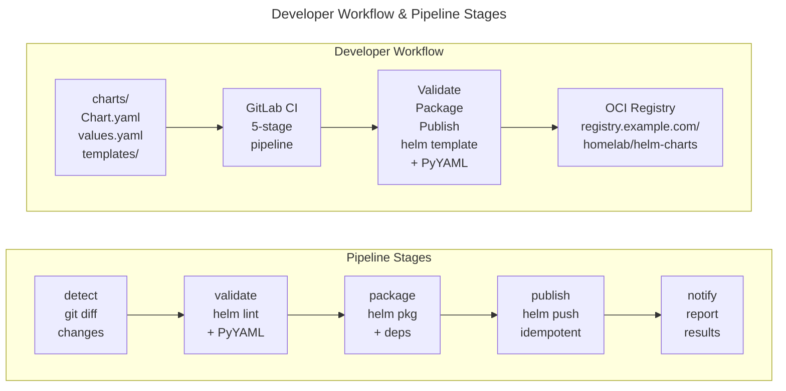

# Helm Charts Collection

<!-- markdownlint-disable MD013 -->

[](LICENSE)
[](https://helm.sh)
[](https://kubernetes.io)
[](charts/)
[](https://helm.sh/docs/topics/registries/)

<!-- markdownlint-enable MD013 -->

Production-ready Helm charts for Kubernetes, distributed via OCI registry.
Features modular CI/CD automation, cluster-free testing, and comprehensive
validation—all following industry best practices.

## Highlights

- **11 Production Charts** — IoT, productivity, networking, database, and
  privacy tools
- **OCI Registry Distribution** — Modern containerized Helm chart delivery
- **Cluster-Free Testing** — Validates charts without requiring a Kubernetes
  cluster
- **Idempotent CI/CD** — GitLab pipeline with smart versioning and safe
  publishing
- **ShellCheck-Validated Scripts** — Production-quality Bash automation

## Architecture

<!-- markdownlint-disable MD040 -->



<!-- markdownlint-enable MD040 -->

## Available Charts

<!-- markdownlint-disable MD013 -->

### Productivity & Knowledge

| Chart                        | Description                                             | App Version | Chart Version |
| ---------------------------- | ------------------------------------------------------- | ----------- | ------------- |
| [affine](charts/affine/)     | Privacy-focused knowledge base & collaboration platform | 0.25.7      | 1.0.6         |
| [freshrss](charts/freshrss/) | Self-hosted RSS feed aggregator                         | 1.28.0      | 1.0.1         |

### Networking & Security

| Chart                              | Description                               | App Version | Chart Version |
| ---------------------------------- | ----------------------------------------- | ----------- | ------------- |
| [cloudflared](charts/cloudflared/) | Cloudflare Tunnel for secure connectivity | 2025.11.1   | 1.0.0         |
| [privatebin](charts/privatebin/)   | Minimal, encrypted online pastebin        | 2.0.3       | 1.0.0         |
| [searxng](charts/searxng/)         | Privacy-respecting metasearch engine      | 2025.12.26  | 1.0.3         |

### Utilities & Tools

| Chart                                | Description                          | App Version | Chart Version |
| ------------------------------------ | ------------------------------------ | ----------- | ------------- |
| [it-tools](charts/it-tools/)         | Collection of IT tools and utilities | 2024.10.22  | 1.0.0         |
| [omni-tools](charts/omni-tools/)     | Multi-purpose tools collection       | 0.6.0       | 1.0.0         |
| [stirling-pdf](charts/stirling-pdf/) | PDF tools and document management    | 2.1.5       | 1.0.0         |

### IoT & Automation

| Chart                                    | Description                          | App Version | Chart Version |
| ---------------------------------------- | ------------------------------------ | ----------- | ------------- |
| [home-assistant](charts/home-assistant/) | Open source home automation platform | 2025.12.2   | 1.0.0         |

### Database & Monitoring

| Chart                      | Description                    | App Version | Chart Version |
| -------------------------- | ------------------------------ | ----------- | ------------- |
| [pgadmin](charts/pgadmin/) | PostgreSQL administration tool | 9.11.0      | 1.0.0         |
| [myspeed](charts/myspeed/) | Network speed testing tool     | 1.0.9       | 1.0.0         |

<!-- markdownlint-enable MD013 -->

## Featured Charts

### home-assistant

Demonstrates advanced Kubernetes patterns:

- **Dual controller support** — Switch between Deployment and StatefulSet via
  `controller.type`
- **Sidecar containers** — Optional code-server for in-cluster configuration
  editing
- **Init containers** — Configuration bootstrapping with custom scripts
- **Multiple ingresses** — Separate ingress resources for main app and sidecars
- **ServiceMonitor** — Prometheus integration for observability

### cloudflared

Production-ready networking chart showcasing:

- **HorizontalPodAutoscaler** — Automatic scaling based on CPU/memory
- **PodDisruptionBudget** — Availability guarantees during cluster operations
- **ServiceMonitor** — Prometheus metrics collection
- **Secret management** — Support for both managed and existing secrets

### affine

Complex stateful application with:

- **Migration jobs** — Database migration as Kubernetes Job with proper hooks
- **Multi-container architecture** — Separate concerns across containers
- **Persistent storage** — PVC management for data persistence
- **Configurable security contexts** — RunAsUser, RunAsGroup, FSGroup support

## Quick Start

```bash
# Login to registry
helm registry login registry.example.com

# Install a chart
helm install my-release \
  oci://registry.example.com/homelab/helm-charts/cloudflared \
  --version 1.0.0

# Install with custom values
helm install my-release \
  oci://registry.example.com/homelab/helm-charts/home-assistant \
  --version 1.0.0 \
  -f my-values.yaml

# View chart configuration options
helm show values \
  oci://registry.example.com/homelab/helm-charts/cloudflared \
  --version 1.0.0
```

## Development

### Repository Structure

```text
helm-charts/
├── charts/                    # Helm charts (11 production-ready)
│   └── <chart-name>/
│       ├── Chart.yaml        # Metadata, version, maintainers
│       ├── values.yaml       # Configuration with @section/@param docs
│       └── templates/        # Kubernetes manifests
├── scripts/ci/               # Modular CI/CD scripts
│   ├── lib/common.sh        # Shared utilities and logging
│   ├── detect-changes.sh    # Git-based change detection
│   ├── validate-chart.sh    # Linting and template validation
│   ├── package-chart.sh     # Dependency resolution and packaging
│   ├── publish-chart.sh     # Idempotent registry publishing
│   └── release.sh           # Main orchestrator
├── docs/                     # Internal standards documentation
├── Makefile                  # Developer commands
└── .gitlab-ci.yml           # CI/CD pipeline definition
```

### Local Development

```bash
# Show all available commands
make help

# Validate a chart (lint + template rendering)
make validate CHART=cloudflared

# Package a chart
make package CHART=cloudflared

# Full release workflow
make release CHART=cloudflared

# Validate all charts
make validate-all

# List available charts
make list-charts
```

### CI/CD Pipeline

This repository uses GitLab CI/CD with a 5-stage pipeline:

| Stage        | Description                                      |
| ------------ | ------------------------------------------------ |
| **detect**   | Identifies changed charts via git diff           |
| **validate** | Runs `helm lint --strict` and PyYAML validation  |
| **package**  | Builds dependencies and creates `.tgz` packages  |
| **publish**  | Pushes to OCI registry (manual approval on main) |
| **notify**   | Reports results                                  |

**Key Features:**

- **Smart versioning** — Auto-generates CI versions (`1.0.0-ci.timestamp`) to
  prevent conflicts
- **Idempotent publishing** — Won't overwrite existing chart versions
- **Change detection** — Only processes modified charts
- **Cluster-free testing** — Uses `helm template` + PyYAML, no Kubernetes
  required

### Chart Standards

All charts follow consistent patterns:

- **Helm v2 API** compliance
- **@section/@param** annotations in `values.yaml` for documentation
- **Standard helpers** in `_helpers.tpl` (labels, selectors, names)
- **existingSecret** pattern for external secret management
- **Validation helpers** using `{{- fail }}` for mutual exclusivity checks

See [docs/CHARTS.md](docs/CHARTS.md) for detailed standards.

## Technical Achievements

| Category     | Achievement                                             |
| ------------ | ------------------------------------------------------- |
| **Charts**   | 11 production-ready charts across 5 categories          |
| **Patterns** | Deployment, StatefulSet, HPA, PDB, ServiceMonitor, Jobs |
| **CI/CD**    | 5-stage pipeline with idempotent publishing             |
| **Testing**  | Cluster-free validation via helm template + PyYAML      |
| **Scripts**  | ShellCheck-validated Bash with modular architecture     |
| **Docs**     | @section/@param annotations, comprehensive README files |

## Contributing

1. Fork the repository
2. Create a feature branch (`git checkout -b feature/new-chart`)
3. Follow [Helm best practices](https://helm.sh/docs/chart_best_practices/)
4. Validate changes: `make validate CHART=<chart-name>`
5. Commit with conventional commits (`feat:`, `fix:`, `docs:`)
6. Open a merge request

### Versioning

Charts follow [Semantic Versioning](https://semver.org/):

- **MAJOR** — Breaking changes requiring user action
- **MINOR** — New features, backward-compatible
- **PATCH** — Bug fixes, backward-compatible

## License

This project is licensed under the MIT License. See [LICENSE](LICENSE) for
details.

---

**Note:** This repository uses GitLab CI/CD. The pipeline configuration is in
[.gitlab-ci.yml](.gitlab-ci.yml).
