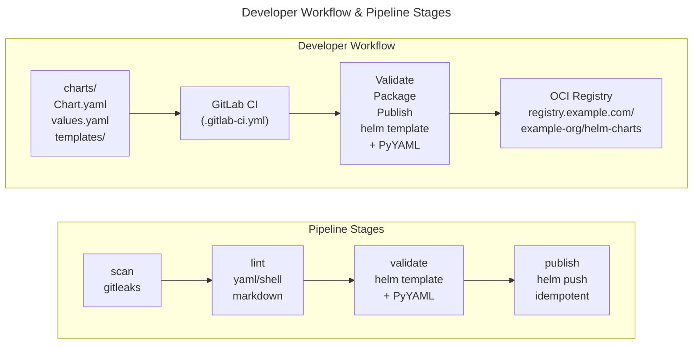

# Helm Charts Collection

<!-- markdownlint-disable MD013 -->

[](LICENSE)
[](https://source.example.com/example-org/helm-charts/-/pipelines)
[](https://helm.sh)
[](https://kubernetes.io)
[](charts/)
[](https://helm.sh/docs/topics/registries/)

<!-- markdownlint-enable MD013 -->

Production-ready Helm charts for Kubernetes, distributed via OCI registry.
Features modular CI/CD automation, cluster-free testing, and comprehensive
validation—all following industry best practices.

## Highlights

- **12 Production Charts** — Productivity, networking, monitoring, database,
  and privacy tools
- **OCI Registry Distribution** — Modern containerized Helm chart delivery
- **Cluster-Free Testing** — Validates charts without requiring a Kubernetes
  cluster
- **Idempotent CI/CD** — GitLab CI pipeline with smart versioning
  and safe publishing
- **ShellCheck-Validated Scripts** — Production-quality Bash automation

## Architecture

<!-- markdownlint-disable MD040 -->


```mermaid
---
title: Developer Workflow & Pipeline Stages
---

flowchart TB
    subgraph workflow["Developer Workflow"]
        direction LR
        charts["charts/<br/>Chart.yaml<br/>values.yaml<br/>templates/"]
        gitlab["GitLab CI<br/>(.gitlab-ci.yml)"]
        validate["Validate<br/>Package<br/>Publish<br/>helm template<br/>+ PyYAML"]
        registry["OCI Registry<br/>registry.example.com/<br/>example-org/helm-charts"]

        charts --> gitlab --> validate --> registry
    end

    subgraph pipeline["Pipeline Stages"]
        direction LR
        scan["scan<br/>gitleaks"]
        lint["lint<br/>yaml/shell<br/>markdown"]
        val["validate<br/>helm template<br/>+ PyYAML"]
        publish["publish<br/>helm push<br/>idempotent"]

        scan --> lint --> val --> publish
    end

    workflow ~~~ pipeline

```

<!-- markdownlint-enable MD040 -->

## Available Charts

<!-- markdownlint-disable MD013 -->

### Deployed

Charts consumed by an app in the [argo-apps](https://source.example.com/example-org/argo-apps)
cluster.

| Chart                                | Description                               | App Version         | Chart Version |
| ------------------------------------ | ----------------------------------------- | ------------------- | ------------- |
| [actual](charts/actual/)             | Budgeting and personal finance app        | 26.6.0              | 1.0.2         |
| [cloudflared](charts/cloudflared/)   | Cloudflare Tunnel for secure connectivity | 2026.5.2            | 1.0.2         |
| [docuseal](charts/docuseal/)         | Document signing platform                 | 3.0.2               | 1.0.2         |
| [joplin](charts/joplin/)             | Note-taking and synchronisation server    | 3.7.1               | 1.0.1         |
| [litellm](charts/litellm/)           | LLM proxy / gateway                       | v1.83.14-stable     | 1.0.0         |
| [oauth2-proxy](charts/oauth2-proxy/) | Traefik ForwardAuth / OIDC proxy          | v7.15.2             | 1.0.1         |
| [open-webui](charts/open-webui/)     | Multi-model AI chat front-end             | v0.9.6              | 1.0.1         |
| [pocket-id](charts/pocket-id/)       | OIDC identity provider                    | v2.8.0              | 1.0.2         |
| [privatebin](charts/privatebin/)     | Minimal, encrypted online pastebin        | 2.0.4               | 1.0.0         |
| [searxng](charts/searxng/)           | Privacy-respecting metasearch engine      | 2026.6.2-e964708c0  | 1.0.7         |

### Reserve (not yet deployed)

Maintained and published, but no argo-apps app consumes them yet. Kept ready so
deploying one is just adding an app `config.yaml` that references the chart.

| Chart                                | Description                          | App Version         | Chart Version |
| ------------------------------------ | ------------------------------------ | ------------------- | ------------- |
| [freshrss](charts/freshrss/)         | Self-hosted RSS feed aggregator      | 1.29.1              | 1.0.1         |
| [it-tools](charts/it-tools/)         | Collection of IT tools and utilities | 2024.10.22-7ca5933  | 1.0.0         |
| [omni-tools](charts/omni-tools/)     | Multi-purpose tools collection       | 0.6.0               | 1.0.0         |
| [pgadmin](charts/pgadmin/)           | PostgreSQL administration tool       | 1.38                | 1.0.1         |
| [pulse](charts/pulse/)               | Uptime monitoring dashboard          | 5.1.33              | 1.0.2         |
| [stirling-pdf](charts/stirling-pdf/) | PDF tools and document management    | 2.11.0              | 1.0.1         |

<!-- markdownlint-enable MD013 -->

## Featured Charts

### cloudflared

Production-ready networking chart showcasing:

- **HorizontalPodAutoscaler** — Automatic scaling based on CPU/memory
- **PodDisruptionBudget** — Availability guarantees during cluster operations
- **ServiceMonitor** — Prometheus metrics collection
- **Secret management** — Support for both managed and existing secrets

### searxng

Most actively maintained chart (27 releases) demonstrating:

- **Complex configuration** — Multi-section settings with secret injection
- **Redis integration** — Optional cache backend with connection management
- **Environment layering** — Base config + secret overrides pattern
- **Rapid iteration** — Frequent upstream tracking with stable chart API

### stirling-pdf

Feature-rich document processing chart showcasing:

- **Resource-intensive workloads** — Configurable limits for CPU-heavy PDF
  operations
- **Security contexts** — Non-root execution with proper filesystem permissions
- **Persistent storage** — PVC management for temporary and permanent data
- **Health checks** — Liveness and readiness probes for long-running operations

## Quick Start

```bash
# Login to registry
helm registry login registry.example.com

# Install a chart
helm install my-release \
  oci://registry.example.com/example-org/helm-charts/cloudflared \
  --version 1.0.1

# Install with custom values
helm install my-release \
  oci://registry.example.com/example-org/helm-charts/searxng \
  --version 1.0.27 \
  -f my-values.yaml

# View chart configuration options
helm show values \
  oci://registry.example.com/example-org/helm-charts/cloudflared \
  --version 1.0.1
```

## Development

### Repository Structure

```text
helm-charts/
├── charts/                    # Helm charts (12 production-ready)
│   └── <chart-name>/
│       ├── Chart.yaml        # Metadata, version, maintainers
│       ├── values.yaml       # Configuration with @section/@param docs
│       └── templates/        # Kubernetes manifests
├── scripts/ci/               # Modular CI/CD scripts
│   ├── lib/common.sh        # Shared utilities and logging
│   ├── detect-changes.sh    # Git-based change detection
│   ├── validate-chart.sh    # Linting and template validation
│   ├── package-chart.sh     # Dependency resolution and packaging
│   ├── publish-chart.sh     # Idempotent registry publishing
│   └── release.sh           # Main orchestrator
├── docs/                     # Internal standards documentation
├── Makefile                  # Developer commands
└── .ci/                    # CI/CD scripts invoked by GitLab CI
```

### Local Development

```bash
# Show all available commands
make help

# Validate a chart (lint + template rendering)
make validate CHART=cloudflared

# Package a chart
make package CHART=cloudflared

# Full release workflow
make release CHART=cloudflared

# Validate all charts
make validate-all

# List available charts
make list-charts
```

### CI/CD Pipeline

This repository uses GitLab CI ([`.gitlab-ci.yml`](.gitlab-ci.yml)), run on a
self-hosted runner, with four stages:

| Stage        | Description                                              |
| ------------ | -------------------------------------------------------- |
| **scan**     | gitleaks secret scan (full history)                      |
| **lint**     | yaml / shell / Markdown lint (per-tool jobs)             |
| **validate** | `helm template` render + PyYAML parse per changed chart  |
| **publish**  | Package + push changed charts to OCI, notify (on `main`) |

**Key Features:**

- **Smart versioning** — Auto-generates CI versions (`1.0.0-ci.timestamp`) to
  prevent conflicts
- **Idempotent publishing** — Won't overwrite existing chart versions
- **Change detection** — Only processes modified charts
- **Cluster-free testing** — Uses `helm template` + PyYAML, no Kubernetes
  required

### Chart Standards

All charts follow consistent patterns:

- **Helm v2 API** compliance
- **@section/@param** annotations in `values.yaml` for documentation
- **Standard helpers** in `_helpers.tpl` (labels, selectors, names)
- **existingSecret** pattern for external secret management
- **Validation helpers** using `{{- fail }}` for mutual exclusivity checks

See [docs/charts.md](docs/charts.md) for detailed standards.

## Technical Achievements

| Category     | Achievement                                             |
| ------------ | ------------------------------------------------------- |
| **Charts**   | 12 production-ready charts across 5 categories          |
| **Patterns** | Deployment, StatefulSet, HPA, PDB, ServiceMonitor, Jobs |
| **CI/CD**    | GitLab CI pipeline with idempotent publishing           |
| **Testing**  | Cluster-free validation via helm template + PyYAML      |
| **Scripts**  | Python CI scripts with pytest unit tests                |
| **Docs**     | @section/@param annotations, comprehensive README files |

## Contributing

1. Fork the repository
2. Create a feature branch (`git checkout -b feature/new-chart`)
3. Follow [Helm best practices](https://helm.sh/docs/chart_best_practices/)
4. Validate changes: `make validate CHART=<chart-name>`
5. Commit with conventional commits (`feat:`, `fix:`, `docs:`)
6. Open a merge request

### Versioning

Charts follow [Semantic Versioning](https://semver.org/):

- **MAJOR** — Breaking changes requiring user action
- **MINOR** — New features, backward-compatible
- **PATCH** — Bug fixes, backward-compatible

## License

This project is licensed under the MIT License. See [LICENSE](LICENSE) for
details.

---

**Note:** The pipeline is defined in [`.gitlab-ci.yml`](.gitlab-ci.yml) and
runs on a self-hosted GitLab runner; the build/validate/publish scripts it
invokes live in [.ci/](.ci/).
